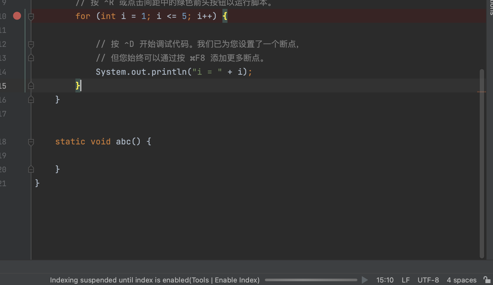

# IntelliJ Stop Indexing plugin

The **Stop Indexing** plugin makes the UI of your IDE more responsive by allowing it to index files only when it's allowed by menu: **Tools | Enable Index**.

## Rationale

Have you ever noticed your IDE becomes less responsive when it's indexing files during the startup or on opening a project?

The **Stop Indexing** plugin allows your IDE to **index files only when the IDE is allowed** and suspends indexing immediately when the menu changes or IDE got restarted. The plugin **frees up your CPU, so it can be very responsive** to your keyboard input and mouse events or open project. The default behavior is suspends indexing.

Pros:

* **More responsive UI** ⚡ while indexing is in stopped

Cons:

* Incomplete code insight results while indexing is in progress
* The IDE disables some actions while indexing is in progress

⬇️ Install the Stop Indexing plugin and check if it improves your experience during open very big project.

## Installation

1. Install the **Stop Indexing** plugin file [build/distributions/stop indexing.zip](build/distributions/stop indexing.zip) to "File | Settings | Plugins"
2. Restart your IDE

## Why does your IDE index files?

The IDE indexes files to make lots of code insight features faster, often as fast as you type your code:

* Code completion
* Go to definition
* Find usages
* Rename refactoring
* Search Everywhere
* Type hierarchy
* And so on

The price to pay here is time to index all your project files and its dependencies. Full indexing happens only once on opening your project for the first time. Then the IDE updates the index incrementally when you add project files or install new libraries as project dependencies.

## Why is it OK to postpone indexing?

So you need your IDE to have indexes for faster code insight, but want it to remain responsive when it is indexing files. The Stop Indexing plugin offers a solution: index files only when the IDE is allowed, so it doesn't affect the UI responsiveness. But is it OK to work with your IDE while indexing is incomplete? It depends on whether you are OK with incomplete results for code insight during indexing:

* Code completion lists might be incomplete
* It might be not possible to go to the definitions of some references
* Some un-indexed results might be missing in Search Everywhere
* And so on

For all these situations the IDE will clearly indicate that "Results might be incomplete while indexing is in progress". For some programming languages like Java these incomplete results are better than for other languages. The situation with incomplete results in programming languages will improve in future versions.

## Reference
https://github.com/vlasovskikh/intellij-idle-indexing